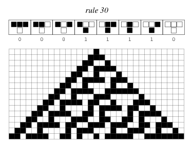
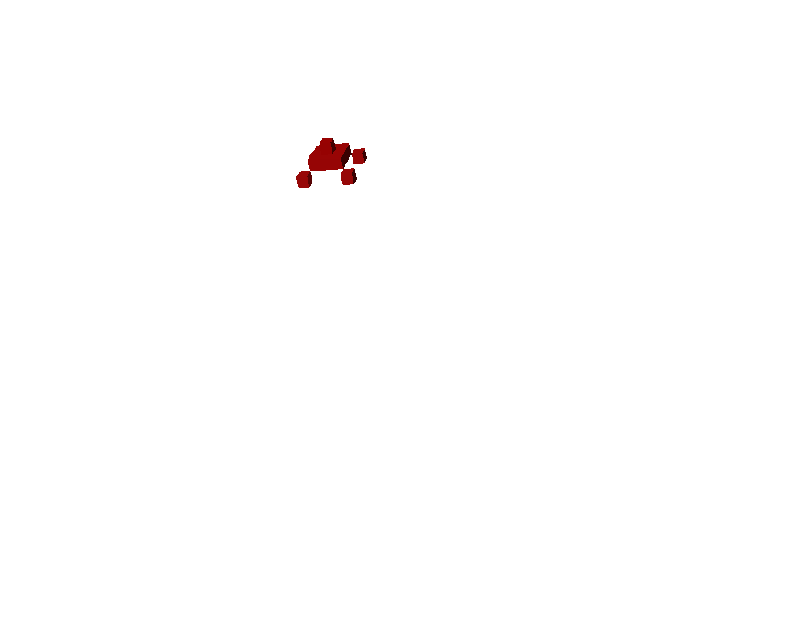
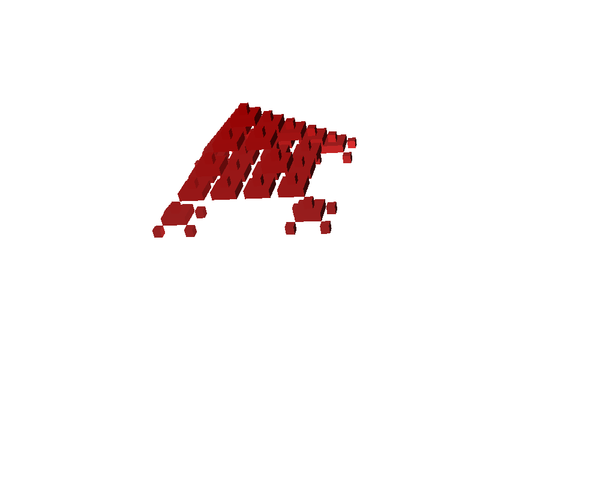
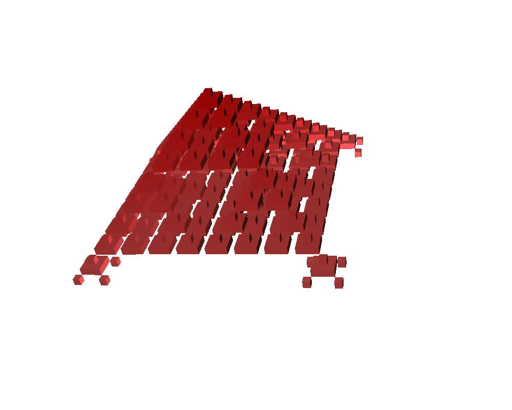

# AcAs
Asynchronous Cellular Automaton Simulator GPU computing OpenCL

Introduction
============

The purpose of this work is the creation of a simulator for synchronous,
asynchronous, and probabilistic cellular automata. Cellular automata are
a powerful representation model for physical and biological phenomena,
for this reason we wanted to create a cellular automata simulator that
can handle multiple types of cellular automata, suitable to be used for
these simulations.

The desire to simulate biological phenomena have leads to the need to
use variants of cellular automata best suited to perform these
simulations, as these systems are inherently asynchronous. One of these
variants, asynchronous cellular automata (ACA), was introduced for this
purpose and its implementation represents one of the main innovative
aspects of the simulator developed.

Since cellular automata are a model widely used, there are already some
simulators. These simulators are plagued by several problems that make
them unfit to perform simulations in biology. In particular, they do not
deal with asynchronous cellular automata and do not allow to perform
simulations with large amounts of data. The current simulators, for the
most part, are not multi-platform, are not able to exploit all the
available hardware, such as graphics processing units (GPUs), and are
usually programmed with single thread.

The objective of this work was therefore to develop a simulator that:

-   Has the ability to simulate inherently asynchronous biological
    phenomena. This led to the introduction of the ability to simulate
    asynchronous cellular automata.

-   Must be portable across operating systems.

-   Can properly use the hardware of modern computers.

-   Provides the ability to run simulations with a large amount of data.

-   Gives the user the ability to insert local rules without
    restrictions.

-   Has the ability to perform simulations in one, two or three
    dimensions.

A simulator with the features mentioned above can effectively execute
the simulation of phenomena for which there are models based on cellular
automata.

How To Use
==========

COMING SOON!

Cellular Automata
=================

A cellular automaton can be seen as a set of cells arranged on a
lattice. Every cell has a state taken from a finite set. At each
iteration all cells are updated synchronously according to their state
and the state of a finite number of neighboring cells using a local rule
common to all cells. The dynamics of cellular automata can be very
complex even for simple local rules. For this reason they are a
complement to differential equations as a tool for modeling physical and
biological phenomena.

Those just described are classical cellular automata, or in which all
cells are updated simultaneously. In addition to classical cellular
automata, there are variants that we have decided tu support that are
interesting not only for theory. In particular:

-   Probabilistic: the updating of the cell depends on a fixed
    probability $p$.

-   Asynchronous: the update is completely asynchronous, at each
    iteration a single cell is updated.

Both these variants are important because they allow to handle
simulations of non-synchronous systems. In fact, they are commonly used
to simulate natural phenomena.

Computation on GPUs
===================

We have chosen to use the computation on GPUs, in particular the use of
the *OpenCL* (*Open Computing Language technology*). In this way so that
the processing of large amounts of data can be performed more
effectively.

Parallel programming on GPU, or GPGPU, *General-Purpose computing on
Graphics Processing Units* born around the year 2000, when some
researchers began to use the GPU to perform general computing
applications. They realized that the computing power of GPUs allows to
improve the performance of many scientific applications.

With the evolving structure of the video card was created OpenCL, a
framework specific for GPU programming in C++. This framework
facilitates programming and allows to use the computing power of GPUs.

OpenCL was created to take advantage of GPU hardware, but it can also be
used on CPUs (when a GPU that supports the framework is absent).

The reason for the discrepancy in performance between the CPU and GPU is
due to the fact that, having to deal with rendering, the GPU is
specialized in highly parallel and computationally intensive operations.

Due to the parallel nature of *cellular automata* we can take advantage
of GPU parallelism.

Comparison with other simulators
================================

The simulator developed was compared with the most used and general *AC*
simulators, excluding the ones that can be used only for the study of a
single phenomenon. The existing simulators are weak in at least one of
these aspects:

-   Low portability.

-   They performs only a restricted set of rules.

-   Difficulty of performing simulations with a large amount of data.

-   They do not adequately take advantage of the existing hardware of
    computers.

-   It is impossible to simulate non-synchronous variations of classical
    cellular automata.

-   They can work in only one or two dimensions.

The simulator aims achieved the goals of managing cellular automata
variants suitable for the simulation of natural phenomena (asynchronous
and probabilistic automata) to be multi-platform, it can be programmed
with any rule, it can operate on very large data sets, it is easily
expandable, and it is able to exploit the current hardware
architectures. These are the characteristics that makes it different
from current simulators. It was confronted with two popular simulators
(JCASim and Mirek’s Java Cellebration) analyzing its strengths and
weaknesses.

Structure of the simulator
==========================

The simulator is designed to run in batch mode, the user controls the
operation via a configuration file. The simulation results are then
stored on one or more output files. The output files of
three-dimensional simulations can be processed by a *perl* script which,
using a *ray tracing* software (Povray), is able to generate images and
movies of the simulations.

More specifically, the structure of the simulator is mainly hierarchical
and modular. The three different types of automation, *Synchronous,
Probabilistic, Walk* derived from a single class, *Simulator*. Each of
the three classes has three sub-classes corresponding to different
dimensions in which the simulations can be performed. The simulator was
designed to simplify the maintenance and the inclusion of new types of
cellular automata.

An important feature offered by the simulator is in the calculation of
submatrices. This feature is useful with very large universes with few
active cells. In this case it is possible to run the simulator only on
these blocks, saving time and resources during execution.

  

Conclusions and Future Developments
===================================

A simulator that can simulate classic, asynchronous and probabilistic
cellular automata has been developed. It works on a wide range of
machines using all the potential of the hardware. The simulator has been
developed is to satisfy some needs not covered by other simulators, such
as providing the opportunity to work on large data sets in batch mode
without being too complex for the end user. The ability of the simulator
to handle non-classical cellular automata, often used for modeling
physical and biological phenomena is another important feature.

Possible future developments of this project are mainly:

-   Provide the system with a graphical interface if you do not want to
    run simulations in batch mode.

-   Provide the system with a compression algorithm for the output. This
    feature will allow to speed up writing to disk.

-   Adding other types of cellular automata (e.g. CA with non-uniform
    local rules).

-   Provide tools to collect statistics of the simulation.

-   Better memory management to increase the maximum simulation size.

-   Development of precompiled functions to support the user in writing
    rules.

The graphical interface would facilitate the inclusion of inputs and the
output displays.

A decompression algorithm of the inputs (a compression algorithm for the
outputs) it would be useful to reduce the bottleneck represented by
writing to disk. It would be interesting to implement this functionality
with the use of *OpenCL*.

It may be also necessary to add new types of cellular automata. It would
also be useful to add a tool to collect statistics on the simulation,
such as the number of cells in a given state at every time step.

A more detailed study of the use of memory may lead to a reduction in
its use and consequently in an increase of the maximum size of the
simulated systems.

